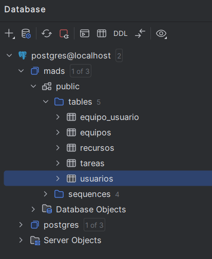

# Documentation of Practice 3 MADS Cristian Andrés Córdoba Silvestre (DNI 05988721G)

## URL of the Original Github Repository
[https://github.com/mads-UA-24-25/todo-list-CrisSX-Yeah](https://github.com/mads-UA-24-25/todo-list-CrisSX-Yeah)

## URL of DockerHub
[https://hub.docker.com/r/bledyx/mads-todolist](https://hub.docker.com/r/bledyx/mads-todolist)

## URL of Trello's Board Project
[https://trello.com/b/eBZ7BFYS/todolist-mads](https://trello.com/b/eBZ7BFYS/todolist-mads)


## The link to the GitHub Board Project is the following:

[https://github.com/orgs/mads-UA-24-25/projects/70](https://github.com/orgs/mads-UA-24-25/projects/70)


## Image of the final state of the Database Schema



# ToDoList Application: Features Implemented in 1.2.0 release

## "009 Manage the Belonging to a Team" Feature"

### Overview
As a user, I will be able to create new teams and add or remove
myself from any of them in order to participate or stop participating
in them.

### Classes and Methods Created

#### `src/main/java/madstodolist/model/Equipo.java`
- **Key Method:**
  - `deleteUsuario (Usuario usuario)`: It ensures correct deletion of the user of a team in both part of the relationship between User and Team.

#### `src/main/java/madstodolist/service/EquipoService.java`
- **Key Method:**
  - `borrarEquipo(Long equipoId)`: It deletes a team by its ID.

#### `src/main/java/madstodolist/controller/EquipoController.java`
- **Modified or created Methods:**
  - `@GetMapping("/logeados/equipos/nuevo-equipo") public String formNuevoEquipo`: This endpoint returns the form of the creation of a new team using a GET HTTP Operation.
  - `@PostMapping("/logeados/equipos/nuevo-equipo") public String nuevoEquipo`: This endpoint manages the creation of a new team using a POST HTTP Operation.
  - `@PostMapping("/logeados/equipos/{equipo-id}/agrega-usuario-logeado/{usuario-id}") public String agregarUsuarioLogeadoEnEquipo`: This endpoint manages the addition of a user into an existing team using a POST HTTP Operation.
  - `@PostMapping("/logeados/equipos/{equipo-id}/agrega-usuario-logeado/{usuario-id}") public String eliminaUsuarioLogeadoDeEquipo`: This endpoint manages the deletion of a user into an existing team using a POST HTTP Operation.

### New Thymeleaf Templates

#### `src/main/resources/templates/formNuevoEquipo.html`
- **Purpose:** This template displays the form to create a new team.

### Updated Thymeleaf Templates
#### `src/main/resources/templates/listaEquipos.html`
- **Purpose of the modification:** To include the add/delete user to the team buttons.

### Tests Implemented

#### `src/test/java/madstodolist/controller/EquipoWebTest.java`
- **Purpose:** Tests user-related functionalities in the controller layer.
- **Key Tests:**
  - **getNuevoEquipoDevuelveForm:** It Ensures that the correct form is being returned to create a new team.
  - **postNuevoEquipoDevuelveRedirectYAgregaEquipo:** It Ensures that a new team is correctly created and the user is redirected to the listing teams webpage.
  - **agregarYLuegoEliminaUsuarioLogeadoDeEquipo:** It verifies that the application manages correctly the addition and the deletion of a user into a team.


### Example Source Code

#### `src/main/resources/templates/listaEquipos.html` - Listing of Teams
A new logic has been added to the template to include the add/delete `user` to the team buttons using the `th:if` directive.

```html
<!DOCTYPE html>
<html xmlns:th="http://www.thymeleaf.org">

<head th:replace="fragments :: head (titulo='Lista de Equipos')"></head>

<body>
<div th:replace="fragments::menuBar"></div>
<div class="container mt-4">
  <h2>Lista de Equipos</h2>

  <!-- Flash Messages -->
  <div th:if="${mensaje}" class="alert alert-success" role="alert">
    <span th:text="${mensaje}"></span>
  </div>

  <table class="table table-striped mt-3">
    <thead>
    <tr>
      <th>ID</th>
      <th>Nombre</th>
      <th>Ver Miembros del Equipo</th>
      <th>Acción</th>
    </tr>
    </thead>
    <tbody>
    <tr th:each="equipo, iStat : ${equipos}">
      <td th:text="${equipo.id}"></td>
      <td th:text="${equipo.nombre}"></td>
      <td>
        <a th:href="@{'/logeados/equipos/' + ${equipo.id} + '/miembros'}">Ver Miembros del Equipo</a>
      </td>
      <td>

        <form th:action="@{'/logeados/equipos/' + ${equipo.id} + '/agrega-usuario-logeado/' + ${usuario.id} }"
              method="post"
              th:if="${!equiposPertenecientes[iStat.index]}"
              class="d-inline me-2">
          <input type="hidden" name="_csrf" th:value="${_csrf.token}" />
          <button type="submit" class="btn btn-sm btn-success">
            <span th:text="'Agregarme al Equipo'"></span>
          </button>
        </form>
        <form th:action="@{'/logeados/equipos/' + ${equipo.id} + '/elimina-usuario-logeado/' + ${usuario.id} }"
              method="post"
              th:if="${equiposPertenecientes[iStat.index]}"
              class="d-inline me-2">
          <input type="hidden" name="_csrf" th:value="${_csrf.token}" />
          <button type="submit" class="btn btn-sm btn-danger">
            <span th:text="'Eliminarme del Equipo'"></span>
          </button>
        </form>

        <a th:if="${usuario != null and usuario.admin}" th:href="@{'/admin/auth/equipos/' + ${equipo.id} + '/editar'}" class="btn btn-primary btn-sm">Editar</a>

        <form th:if="${usuario != null and usuario.admin}" th:action="@{'/admin/auth/equipos/' + ${equipo.id} + '/borrar'}" method="post" style="display:inline;">
          <input type="hidden" name="_csrf" th:value="${_csrf.token}" />
          <button type="submit" class="btn btn-danger btn-sm"
                  onclick="return confirm('¿Estás seguro de que quieres borrar este equipo?');">
            Borrar
          </button>
        </form>

      </td>
    </tr>
    </tbody>
  </table>

  <a th:href="@{'/logeados/equipos/nuevo-equipo'}" class="btn btn-success">Nuevo Equipo</a>

</div>

<div th:replace="fragments::javascript"></div>
</body>
</html>
```

## "010 Administration of Teams" Feature

### Overview
This feature will enable the administrator to change the name and to delete teams.

### Classes and Methods Created

#### `src/main/java/madstodolist/service/EquipoService.java`
- **Key Methods:**
  - `public EquipoData modificarNombreEquipo(Long equipoId, String newName)`: This method manages the entity logic related with the modification of the name of a team.
  - `public void borrarEquipo(Long equipoId)`: This method manages the entity logic related with the deletion of a team.

#### `src/main/java/madstodolist/controller/EquipoController.java`
- **Key Methods:**
  - `@GetMapping("/admin/auth/equipos/{id}/editar") public String formEditarEquipo`: This method creates an endpoint that returns the form to change the name of a team.
  - `@PostMapping("/admin/auth/equipos/{id}/editar") public String editarEquipo`: This method creates and endpoint that manages the change of the name of a team.
  - `@PostMapping("/admin/auth/equipos/{id}/borrar") public String borrarEquipo`: This method creates an endpoint that manages the deletion of a team.

### New Thymeleaf Templates

#### `src/main/resources/templates/formEditarEquipo.html`
- **Purpose:** This template displays the form to change the name of a team.

### Updated Thymeleaf Templates
#### `src/main/resources/templates/listaEquipos.html`
- **Key Features:**
  - **"Edit" button:** Added an `Edit` button to each team row that redirects to the form to change the `team's name`.
  - **"Delete" button:** Added a `Delete` button to each team row that allows the administrator to delete the `team`.
  - **Administrator verification** The `Edit` and `Delete` buttons are only displayed to the administrator. To achieve this, `th:if` directives are used.
 
### Tests Implemented

#### `src/test/java/madstodolist/service/UsuarioServiceTest.java`
- **borrarEquipo:** Test the service layer for the deletion of a team.


#### `src/test/java/madstodolist/controller/EquipoWebTest.java`
- **Key Tests:**
  - **formEditarEquipo:** Test that the correct form is returned to edit a team.
  - **editarEquipo:** Test that the team's name is correctly modified using the controller layer.
  - **borrarEquipo:** Test that the team is correctly deleted using the controller layer.
  - **Tests that verify exceptions:** Test that the application correctly handles exceptions with respect to the team controller layer.

### Example Source Code

#### `src/main/resources/templates/formEditarEquipo.html` - Edit Team Form
This template manages the modification of the name of a team.

```html
<!DOCTYPE html>
<html xmlns:th="http://www.thymeleaf.org">

<head th:replace="fragments :: head (titulo='Login')"></head>

<body>
<div th:replace="fragments::menuBar"></div>
<div class="container-fluid">

  <h2 th:text="'Modificación del Equipo ' + ${equipo.getId()}"></h2>

  <form method="post" th:action="@{/admin/auth/equipos/{id}/editar(id=${equipo.id})}" th:object="${equipo}">
    <div class="col-6">
      <div class="form-group">
        <label for="nombre">Nombre del Equipo:</label>
        <input class="form-control" id="nombre" name="nombre" required th:field="*{nombre}" type="text"/>
      </div>
      <button class="btn btn-primary" type="submit">Modificar equipo</button>
      <a class="btn btn-link" th:href="@{/logeados/equipos}">Cancelar</a>
    </div>
  </form>
</div>

<div th:replace="fragments::javascript"/>

</body>
</html>
```

